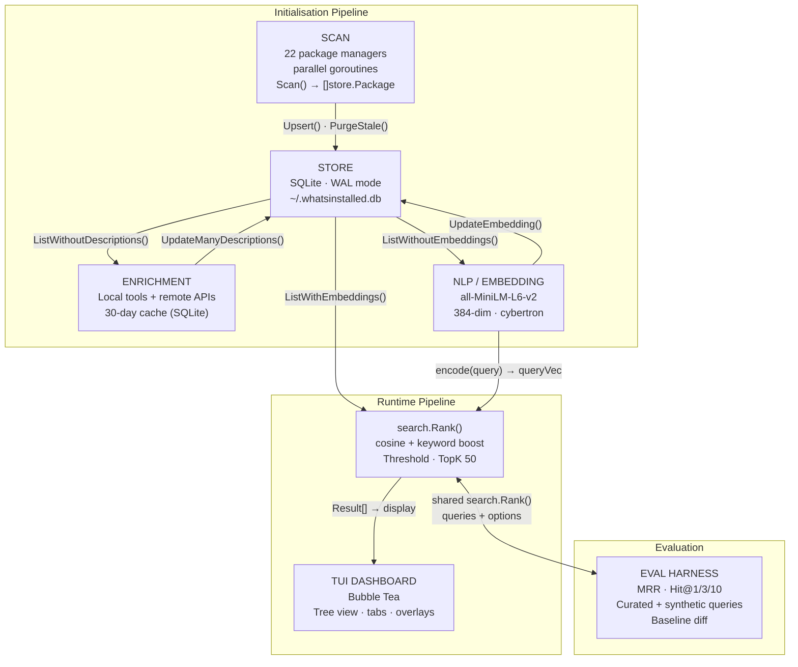

# whatsinstalled — Architecture

Package inventory and semantic search CLI/TUI for Linux. Scans installed
packages across 22 package managers, enriches them with descriptions, embeds
them with a BERT model, and supports natural-language search.

## Data Flow



## Package Layout

```
cmd/whatsinstalled     — binary entrypoint (main.go)
cmd/enrich       — one-off enrichment helper

internal/cmd     — Cobra commands (root, scan, eval)
internal/cmd/root.go         — rootCmd, TUI launcher, --db flag
internal/cmd/subcommands.go  — whatsinstalled scan
internal/cmd/eval.go         — whatsinstalled eval + variant selectors

internal/scanner — one file per package manager (22 total)
scanner.go         — Scanner interface: Name, Scan, IsAvailable, Probe
discovery.go       — AllScanners registry + DiscoverScanners()
apt.go             — dpkg-query
snap.go            — snap list
npm.go             — npm list --json (global + local node_modules)
pip.go             — pip list --json (system + venvs)
conda.go           — conda list --json (per environment)
bin.go             — os.ReadDir in known dirs + PATH
brew.go            — brew list --formula
cargo.go           — ~/.cargo/bin readdir
gem.go             — gem list --local
pipx.go            — pipx list --json
uv.go              — uv tool list
pnpm.go            — pnpm ls -g --json
yarn.go            — yarn global list
go.go              — ~/go/pkg/mod walkdir
docker.go          — docker images --format=json
podman.go          — podman images --format=json
pacman.go          — pacman -Q
yay.go             — yay -Q
flatpak.go         — flatpak list --app
nix.go             — nix-env -q
appimage.go        — *.AppImage file scan
pixi.go            — pixi list (global + local manifest)

internal/store     — SQLite persistence
store.go           — Package struct, Store, Open, migrate, CRUD

internal/enrich    — description enrichment
enrich.go          — Enricher, EnrichPackages, descMapForSource routing
local.go           — LocalEnricher: pip show, apt show, brew info, whatis, pacman -Qi
remote.go          — RemoteEnricher: PyPI, npm, crates.io, rubygems (100ms delay)
cache.go           — Cache: get/set/batch in enrichment_cache table (30-day TTL)

internal/nlp       — BERT embedding + NLP helpers
embedder.go        — Embedder, LoadEmbedder, Encode, CosineSimilarity, PackageText
search.go          — ExpandQuery (10 domain keyword sets), KeywordScore

internal/search    — Pure ranking (no DB/UI/network)
rank.go            — Options, Result, Rank, DefaultOptions
eval/              — IR evaluation harness
eval/eval.go       — Query, Metrics, Report, Regression, Aggregate, Diff
eval/queries.json  — Curated golden queries

internal/tui       — Bubble Tea dashboard (~1800 lines in dashboard.go)
dashboard.go       — model, Init, Update, View, loadData, fullInitWithProgress, search
tree.go            — Custom tree view (7 cols: Name, Version, Src, Location, User, Size, Used)
styles.go          — 7 themes (TokyoNight, Nord, Dracula, etc.), format helpers

internal/pkg       — Environment helpers
env.go             — HomeDir, CWD, IsRoot, ShortenPath, FileOwner, GetLastUsed

internal/version   — version.go (const Version = "v1.0.0-beta")
```

## Database Schema

```sql
CREATE TABLE IF NOT EXISTS packages (
    id              INTEGER PRIMARY KEY,
    name            TEXT NOT NULL,
    version         TEXT,
    source          TEXT NOT NULL,
    location        TEXT NOT NULL,
    size_bytes      INTEGER,
    description     TEXT,
    installed_at    TEXT,
    auto_installed  INTEGER DEFAULT 0,
    user            TEXT,
    updated_at      INTEGER,
    last_used       INTEGER,
    embedding       TEXT          -- JSON float64 array (384-dim)
);
CREATE UNIQUE INDEX idx_pkg ON packages(name, source, location);

CREATE TABLE IF NOT EXISTS enrichment_cache (
    name        TEXT NOT NULL,
    source      TEXT NOT NULL,
    description TEXT NOT NULL,
    fetched_at  INTEGER NOT NULL,
    PRIMARY KEY (name, source)
);
```

- DB path: `~/.whatsinstalled.db` (override with `WHATSINSTALLED_DB` env var or `--db` flag)
- WAL mode via `PRAGMA journal_mode=WAL`

## Key Store Methods

| Method | Purpose |
|---|---|
| `Upsert(p Package)` | INSERT … ON CONFLICT(name,source,location) DO UPDATE |
| `List(source, hideAuto)` | Packages with optional source filter |
| `ListWithEmbeddings()` | All packages where embedding IS NOT NULL |
| `ListWithoutEmbeddings()` | Packages where embedding IS NULL |
| `ListWithoutDescriptions(source)` | Packages with empty description |
| `Search(query, source, hideAuto)` | name LIKE %query% |
| `SearchText(query)` | name OR description LIKE %query% |
| `CountBySource(hideAuto)` | map[string]int + total |
| `UpdateManyDescriptions(missing)` | Batch update descriptions |
| `UpdateEmbedding(id, embedding)` | Store JSON vector |
| `PurgeStale(cutoff)` | Remove packages not in current scan cycle |

## Initialisation Pipeline

`fullInitWithProgress()` runs on startup and on `r` rescan. Progress is
reported via channel callbacks that drive the TUI status bar.

### Phase 1 — Scan

- `scanner.DiscoverScanners()` returns only `IsAvailable() && Probe()` scanners
- Each scanner runs in a goroutine; scan progress is sent via channel
- After all goroutines complete, results are upserted sequentially
- `PurgeStale()` removes packages not refreshed in this cycle

### Phase 2 — Enrich

- `ListWithoutDescriptions("")` finds packages with empty descriptions
- `descMapForSource()` routes each source to the right enricher:
  - **bin**: `whatis` + `dpkg -S` → `apt show`
  - **apt**: `apt show`
  - **snap**: `snap info`
  - **brew**: `brew info --json=v2`
  - **pacman/yay**: `pacman -Qi`
  - **pip/pipx/uv**: `pip show` → PyPI API
  - **npm/pnpm/yarn**: `npm info` → npm registry
  - **cargo**: crates.io API (with User-Agent)
  - **gem**: rubygems.org API
  - All others (docker, podman, go, appimage, nix, flatpak): return empty
- Results are cached in `enrichment_cache` (30-day TTL) and written via
  `UpdateManyDescriptions()`

### Phase 3 — Embed

- `ListWithoutEmbeddings()` finds packages needing vectors
- Each package is converted to text via `PackageText(name, source, desc)`,
  which adds source context (e.g., "python package", "debian system package
  manager")
- Encoded via `all-MiniLM-L6-v2` (384-dimensional float32 vector)
- Stored as JSON in the `embedding` column via `UpdateEmbedding()`

After these three phases the DB is fully populated and search is ready.

## Search Pipeline

1. User presses `?` to open the "Ask whatsinstalled" modal
2. As user types, `liveSearch()` runs `db.SearchText(query)` for instant
   substring preview in the modal
3. User presses Enter → `startSearch()` → `search()` runs in a goroutine:
   - `nlp.ExpandQuery(query)` — appends domain synonyms if the query contains
     a known keyword (network, python, web, database, etc.)
   - `embedder.Encode(ctx, expandedQuery)` → 384-dim query vector
   - `db.ListWithEmbeddings()` → all packages with pre-computed vectors
   - `search.Rank(queryVec, query, pkgs, DefaultOptions)`:
     - `Score = CosineSimilarity(queryVec, pkg.Embedding)
       + KeywordWeight × KeywordScore(query, pkg)`
     - Sort descending by score
     - Filter by threshold (0.05); fallback to top 10 if none pass
     - Cap at TopK (50)
4. Results are returned to the TUI via a `semanticSearchResult` message
5. The TUI switches to the Results tab (index 0) and renders the ranked list

### Search Variants

The ranking formula is configurable through `search.Options`:

| Variant | KeywordWeight | Threshold | ExpandQuery |
|---|---|---|---|
| default | 1.0 | 0.05 | true |
| semantic-only | 0.0 | 0.05 | true |
| no-expand | 1.0 | 0.05 | false |
| keyword-2x | 2.0 | 0.05 | true |
| thr-0 | 1.0 | 0.0 | true |

### Graceful Degradation

- No embedder cached → search falls back to `SearchText()` (substring match)
- No embeddings in DB (fresh after scan) → `search()` falls back to
  `SearchText()` while embedding runs in background

## Evaluation Harness

`whatsinstalled eval` runs the same `search.Rank()` function used by the TUI,
computing standard IR metrics:

- **MRR** (Mean Reciprocal Rank)
- **Hit@1, Hit@3, Hit@10**

Queries come from two sources:
- **Curated golden set** (`internal/search/eval/queries.json`) — hand-written
  queries with expected results
- **Synthetic queries** (`--synthetic N`) — generated known-item queries from
  random packages in the DB

Usage:
```bash
whatsinstalled eval                           # default variant, curated + 30 synthetic
whatsinstalled eval --synthetic 50            # 50 synthetic queries
whatsinstalled eval --variant semantic-only   # specific variant
whatsinstalled eval --variant all             # all variants
whatsinstalled eval --out results.json        # save results
whatsinstalled eval --baseline results.json   # diff against baseline (regression detection)
```

Currently `semantic-only` (KeywordWeight=0) achieves MRR 0.640, outperforming
`default` (0.527). The keyword boost currently hurts relevance.

## TUI Structure

```
+-- whatsinstalled -- apt:90 | snap:3 | npm:14 ------ v1.0.0-beta --+
|==============================================================|
:  Name      Version Src  Location     User  Size    Used       :
:  > system                   [45]                             :
:    nginx   1.24.0  apt  system      system 4.2M  12d        :
:    core20  202604  snap system      system  -     -          :
:  v base                      [23]                             :
|==============================================================|
|  [All] [Apt] [Snap] [Npm] [Pip] [Conda] [Bin]  /filter      |
|==============================================================|
|  v Description                         | v Keys              |
:  nginx - web server                    | :  Command palette   :
:                                        | ?  Ask whatsinstalled     :
:                                        | a  About            :
:                                        | q  Quit             :
|==============================================================|
| nginx (apt)  |  whatsinstalled - tokyo-night                        |
+--------------------------------------------------------------+
```

### Keybindings

| Key | Action |
|---|---|
| `j` / `k` / `↑` / `↓` | Navigate tree |
| `→` / `l` / `Space` | Expand group |
| `←` / `h` | Collapse group |
| `Tab` / `Shift+Tab` | Switch source tabs |
| `/` | Filter (substring, current tab) |
| `?` | "Ask whatsinstalled" semantic search |
| `Enter` / `d` | Detail overlay |
| `r` | Rescan all |
| `a` | About modal |
| `t` | Theme picker (7 themes) |
| `:` | Command palette |
| `D` | Toggle auto-installed deps |
| `Esc` | Clear / close / cancel |
| `q` / `Ctrl+C` | Quit |

### Themes

`t` opens a theme picker with 7 themes: TokyoNight (default), Palenight,
Dracula, Nord, Gruvbox, Catppuccin, Monokai. Selection is persisted across
restarts.

## Commands

| Command | Purpose |
|---|---|
| `whatsinstalled` | Launch TUI dashboard |
| `whatsinstalled scan` | CLI rescan, print per-source counts |
| `whatsinstalled eval` | Search ranking evaluation (MRR/Hit@k) |
| `whatsinstalled eval --synthetic N` | Add N synthetic queries |
| `whatsinstalled eval --variant X` | Select ranking variant |
| `whatsinstalled eval --baseline file.json` | Diff against baseline |
| `whatsinstalled --version` | Print version |
| `whatsinstalled --db PATH` | Override DB path |

## Build / Test

```bash
go build ./...                       # compile all packages
go build -o whatsinstalled ./cmd/whatsinstalled  # build the binary
go test ./...                        # full suite
go vet ./...                         # vet
./whatsinstalled                           # launch TUI
./whatsinstalled scan                      # CLI rescan
./whatsinstalled eval --synthetic 30       # evaluate search ranking
./whatsinstalled --version                 # print version
```

## Runtime Facts

- DB: `~/.whatsinstalled.db` (NOT `~/.whatsinstalled/*.db`)
- Embedding model: `~/.whatsinstalled/models/sentence-transformers` (~177MB, 384-dim)
- First run downloads the model; `nlp.LoadEmbedder()` returns an error if
  absent and search degrades to substring fallback
- Init pipeline (`fullInitWithProgress`) scans → enriches → embeds, so search
  is just one query-encode + in-memory scoring (fast, cannot hang)
- Enrichment and embedding are pre-computation only; they do NOT run on the
  search hot path
