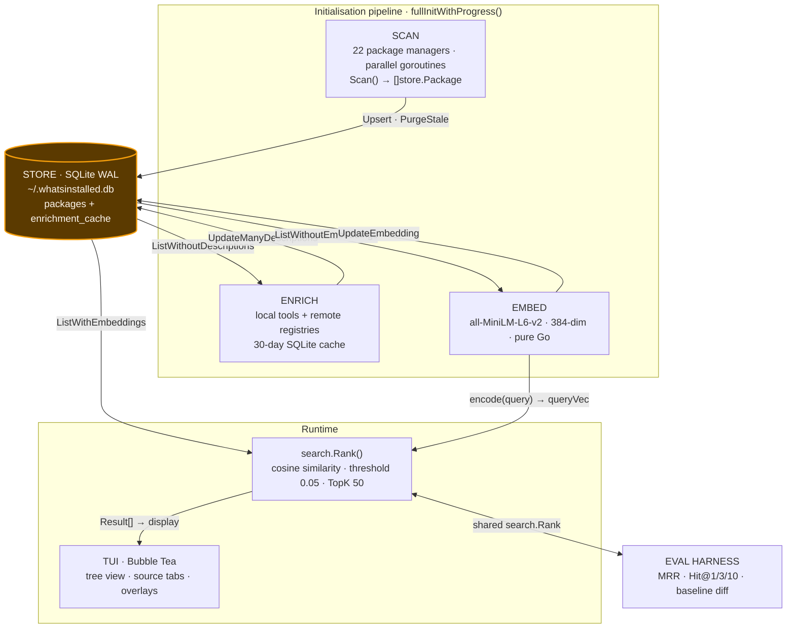
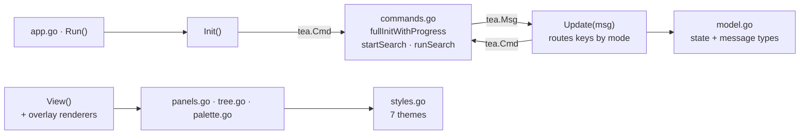

# whatsinstalled — Architecture

This document describes how `whatsinstalled` works internally — the data flow,
storage, pipelines, and packages. For **what it detects, how to use it, and the
keybindings**, see the [README](README.md); this doc deliberately does not repeat
that user-facing reference.

The central design constraint is a **cold search that cannot hang**: all
scanning, enrichment, and embedding happen up front in an init pipeline, so a
query reduces to a single in-memory vector ranking.

## Contents

- [Data Flow](#data-flow)
- [Package Layout](#package-layout)
- [Database Schema](#database-schema)
- [Initialisation Pipeline](#initialisation-pipeline)
- [Search Pipeline](#search-pipeline)
- [Dependency Detection](#dependency-detection)
- [Per-Package Sizes](#per-package-sizes)
- [Location Tracking](#location-tracking)
- [Evaluation Harness](#evaluation-harness)
- [TUI Structure](#tui-structure)
- [Development](#development)
- [Runtime Facts](#runtime-facts)
- [Roadmap & Future Work](#roadmap--future-work)

---

## Data Flow

End-to-end pipeline: **Scan → Enrich → Embed → Search → Display**. SQLite is the
hub every stage reads from and writes back to; everything left of `search.Rank`
is pre-computation that runs only at init.



---

## Package Layout

```text
cmd/whatsinstalled   — binary entrypoint (main.go)
cmd/enrich           — one-off enrichment backfill helper

internal/cmd         — Cobra commands
  root.go            — rootCmd, TUI launcher, --db flag
  subcommands.go     — `whatsinstalled scan`
  eval.go            — `whatsinstalled eval` + variant selectors

internal/scanner     — one file per package manager (22 in the registry)
  scanner.go         — Scanner interface: Name, Scan, IsAvailable, Probe
  discovery.go       — AllScanners registry + DiscoverScanners()
  apt · snap · npm · pip · conda · brew · cargo · gem · go · pixi · pipx
  pnpm · yarn · docker · podman · pacman · yay · flatpak · nix · appimage · uv · bin

internal/store       — SQLite persistence
  store.go           — Package struct, Store, Open, migrate, CRUD, DBPath()

internal/enrich      — description enrichment
  enrich.go          — Enricher, EnrichPackages, per-source routing
  local.go           — LocalEnricher: pip show, apt show, brew info, whatis, pacman -Qi
  remote.go          — RemoteEnricher: PyPI, npm, crates.io, rubygems (throttled)
  cache.go           — Cache over enrichment_cache table (30-day TTL)

internal/nlp         — BERT embedding + NLP helpers
  embedder.go        — Embedder, LoadEmbedder, Encode, CosineSimilarity, PackageText
  search.go          — ExpandQuery (domain keyword sets), KeywordScore

internal/search      — pure ranking (no DB / UI / network)
  rank.go            — Options, Result, Rank, DefaultOptions
  eval/eval.go       — Query, Metrics, Report, Regression, Aggregate, Diff
  eval/queries.json  — curated golden queries

internal/tui         — Bubble Tea dashboard (split by concern — see below)
internal/pkg         — environment helpers (HomeDir, IsRoot, FileOwner, GetLastUsed)
internal/version     — const Version = "v1.0.0-beta"
```

### TUI module structure

The dashboard was split out of a single 1.8k-line file into cohesive units that
map onto Bubble Tea's `Init` / `Update` / `View` contract.



All background work (scan, enrich, embed, search) is dispatched as a `tea.Cmd`
that runs off the UI goroutine and feeds results back as a `tea.Msg`; `Update`
never blocks.

---

## Database Schema

```sql
CREATE TABLE IF NOT EXISTS packages (
    id              INTEGER PRIMARY KEY,
    name            TEXT NOT NULL,
    version         TEXT,
    source          TEXT NOT NULL,
    location        TEXT NOT NULL,
    size_bytes      INTEGER,
    description     TEXT,
    installed_at    TEXT,
    auto_installed  INTEGER DEFAULT 0,
    user            TEXT,
    updated_at      INTEGER,
    last_used       INTEGER,
    embedding       TEXT          -- JSON float array (384-dim)
);
CREATE UNIQUE INDEX idx_pkg ON packages(name, source, location);

CREATE TABLE IF NOT EXISTS enrichment_cache (
    name        TEXT NOT NULL,
    source      TEXT NOT NULL,
    description TEXT NOT NULL,
    fetched_at  INTEGER NOT NULL,
    PRIMARY KEY (name, source)
);
```

- DB path: `~/.whatsinstalled.db` (override with `WHATSINSTALLED_DB` env var or `--db`)
- WAL mode via `PRAGMA journal_mode=WAL`; writes are single-writer/sequential.

### Key store methods

| Method | Purpose |
|---|---|
| `Upsert(p Package)` | `INSERT … ON CONFLICT(name,source,location) DO UPDATE` |
| `List(source, hideAuto)` | packages with optional source filter |
| `ListWithEmbeddings()` | packages where `embedding IS NOT NULL` |
| `ListWithoutEmbeddings()` | packages where `embedding IS NULL` |
| `ListWithoutDescriptions(source)` | packages with empty description |
| `Search(query, source, hideAuto)` | `name LIKE %query%` |
| `SearchText(query)` | `name OR description LIKE %query%` |
| `CountBySource(hideAuto)` | `map[string]int` + total |
| `UpdateManyDescriptions(missing)` | batch description write |
| `UpdateEmbedding(id, embedding)` | store JSON vector |
| `PurgeStale(cutoff)` | drop packages not seen in the current scan cycle |

---

## Initialisation Pipeline

`fullInitWithProgress()` runs on startup and on `r` (rescan). It streams progress
over a channel that drives the splash/status UI. If cached data already exists,
the dashboard renders immediately and the pipeline refreshes in the background.

### Phase 1 — Scan

- `scanner.DiscoverScanners()` returns only scanners that are `IsAvailable()` and
  pass a cheap `Probe()`.
- Each scanner runs in its own goroutine (cost is subprocess wait, so parallel
  scans collapse wall-clock to ≈ the slowest one).
- Results are upserted sequentially (single-writer SQLite); `PurgeStale()` then
  removes anything not refreshed this cycle.

### Phase 2 — Enrich

- `ListWithoutDescriptions("")` finds packages with no description.
- Each source is routed to the right enricher:
  - **bin**: `whatis` + `dpkg -S` → `apt show`
  - **apt**: `apt show` · **snap**: `snap info` · **brew**: `brew info --json=v2`
  - **pacman/yay**: `pacman -Qi`
  - **pip/pipx/uv**: `pip show` → PyPI API
  - **npm/pnpm/yarn**: `npm info` → npm registry
  - **gem**: `gem list --details` (bulk local) → rubygems.org
  - others (docker, podman, go, appimage, nix, flatpak): no description
- Results are cached in `enrichment_cache` (30-day TTL) and written via
  `UpdateManyDescriptions()`.

### Phase 3 — Embed

- `ListWithoutEmbeddings()` finds packages needing vectors.
- `PackageText(name, source, desc)` builds the embedding input, adding source
  context (e.g. "python package", "debian system package manager").
- Encoded with `all-MiniLM-L6-v2` into a 384-dim vector, stored as JSON in the
  `embedding` column via `UpdateEmbedding()`.

After these phases the DB is fully populated and search is ready.

---

## Search Pipeline

1. `?` opens the **"Ask whatsinstalled"** modal.
2. While typing, `liveSearch()` runs `db.SearchText(query)` for an instant
   substring preview inside the modal.
3. `Enter` → `startSearch()` dispatches `runSearch()` as a `tea.Cmd`:
   - `nlp.ExpandQuery(query)` appends domain synonyms when the query contains a
     known keyword (network, python, web, database, …).
   - `embedder.Encode(ctx, expandedQuery)` → 384-dim query vector.
   - `db.ListWithEmbeddings()` → all packages with pre-computed vectors.
   - `search.Rank(queryVec, query, pkgs, DefaultOptions)`:
     - `Score = CosineSimilarity(queryVec, pkg.Embedding) + KeywordWeight × KeywordScore(query, pkg)`
     - sort descending, filter by threshold (0.05), cap at TopK (50).
4. Results return to the TUI as a `semanticSearchResult` message (tagged with a
   `searchVersion` so a superseded search is discarded).
5. The TUI switches to the **Results** tab and renders the ranked list.

### Search variants

The ranking formula is configurable through `search.Options`:

| Variant | KeywordWeight | Threshold | ExpandQuery |
|---|---|---|---|
| default | 0.0 | 0.05 | true |
| semantic-only | 0.0 | 0.05 | true |
| no-expand | 0.0 | 0.05 | false |
| keyword-2x | 2.0 | 0.05 | true |
| thr-0 | 0.0 | 0.0 | true |

### Graceful degradation

- No embedder cached → search falls back to `SearchText()` (substring match).
- No embeddings yet (fresh DB) → `runSearch()` falls back to `SearchText()`
  while embedding completes in the background.

---

## Dependency Detection

Sub-dependencies (packages installed as a side-effect of another package, not
directly by the user) are marked in the `auto_installed` column and shown in the
TUI with a `↳ ` indent prefix. Coverage spans the three largest sources:

| Source | Detection method | Coverage |
|--------|-----------------|----------|
| **apt** | `apt-mark showmanual` cross-reference | All packages |
| **pip** | `pip show` `Required-by:` field (bulk, one call per venv) | System + local venvs |
| **conda** | `conda-meta/*.json` `requested_spec` field | All environments |

Press `D` to toggle dependency visibility (default: shown). Sub-dependencies are
hard-excluded from any future removal tooling — the user cannot remove what the
maintainer controls.

---

## Per-Package Sizes

Sizes are populated from the package's own filesystem path when one can be
resolved at scan time. Coverage:

| Source | Size source | Coverage |
|--------|------------|----------|
| **apt** | `dpkg` `Installed-Size` field | 100% |
| **bin** / **cargo** / **appimage** | File size | 100% |
| **docker** / **podman** | JSON `Size` field | 100% |
| **pipx** / **uv** | Recursive `du` of venv dir | 100% |
| **pip** | `PathSize` on site-packages dir (via `pip show Location:`) | ~54% |
| **conda** | `PathSize` on `pkgs/<name>-<version>-<build>` | ~32% |
| **npm** | `PathSize` on `node_modules/<name>` | ~60% |

The gap in pip/conda/npm is single-file modules and namespace packages where the
per-package directory doesn't follow the standard naming convention. Sources
without a per-package path (snap, flatpak, pacman, yay, nix, brew, go, gem,
pnpm, yarn, pixi) leave size empty.

---

## Location Tracking

All scanners now report real filesystem paths in the `location` column, replacing
hardcoded `"system"` / `"local"` labels:

| Source | Location value |
|--------|---------------|
| **apt** | `/var/lib/dpkg` |
| **snap** | `/snap/<name>` |
| **pip** | `pip show` `Location:` field (site-packages path) |
| **npm** global | `npm root -g` output |
| **npm** local | Project directory path |
| **conda** | Full environment path (`/home/user/miniconda3/envs/<name>`) |
| **docker** | Stat-detected data-root (`/var/lib/docker`, `~/.local/share/docker`, etc.) |
| **podman** | Stat-detected storage-root (`/var/lib/containers/storage`, etc.) |

The tree view groups packages by location, so these paths produce meaningful
group labels in the TUI instead of generic placeholders.

---

## Evaluation Harness

`whatsinstalled eval` runs the **same** `search.Rank()` used by the TUI, so the
metrics reflect real ranking behaviour:

- **MRR** (Mean Reciprocal Rank)
- **Hit@1, Hit@3, Hit@10**

Queries come from a curated golden set (`internal/search/eval/queries.json`) and
optional synthetic known-item queries (`--synthetic N`).

```bash
whatsinstalled eval                           # default variant, curated + 30 synthetic
whatsinstalled eval --synthetic 50            # 50 synthetic queries
whatsinstalled eval --variant semantic-only   # specific variant
whatsinstalled eval --variant all             # every variant
whatsinstalled eval --out results.json        # save results
whatsinstalled eval --baseline results.json   # diff against a baseline
```

> Eval finding: the keyword boost hurts relevance (default MRR ≈ 0.64 vs
> keyword-2x ≈ 0.27). The production default (`DefaultOptions`) sets
> `KeywordWeight = 0` (semantic-only ranking). The mechanism is kept wired
> so the harness can continue to measure variants.

---

## TUI Structure

```text
┌─ whatsinstalled ── apt:90 │ snap:3 │ npm:14 ─────────── v1.0.0-beta ─┐
│══════════════════════════════════════════════════════════════════│
│  Name         Version Src  Location            User  Size  Added  Used │
│  ▾ /var/lib/dpkg               [45]                                   │
│      nginx     1.24.0  apt  /var/lib/dpkg       system 4.2M  12d   3d │
│      ↳ libssl  3.0.2   apt  /var/lib/dpkg       system 2.1M  12d   -  │
│  ▸ /snap/core20                [3]                                    │
│══════════════════════════════════════════════════════════════════│
│  [All] [Apt] [Snap] [Npm] [Pip] [Conda] [Bin]        /filter       │
│══════════════════════════════════════════════════════════════════│
│  ▾ Description                      │ ▾ Keys                        │
│  nginx — web server                 │ :  Command palette            │
│                                     │ ?  Ask whatsinstalled         │
│══════════════════════════════════════════════════════════════════│
│ nginx (apt)  │  whatsinstalled — tokyo-night                      │
└──────────────────────────────────────────────────────────────────┘
```

The tree leaf row has **8 columns**: Name · Version · Source · Location · User ·
Size · Added · Used. The full keybinding reference lives in the
[README](README.md#key-bindings-tui).

Themes are defined in `styles.go` (7 built-ins); `applyTheme` rebuilds the
colour and style variables, and the choice is persisted under
`~/.config/whatsinstalled/`.

---

## Development

```bash
go build ./...                                   # compile all packages
go build -o whatsinstalled ./cmd/whatsinstalled  # build the binary
go test ./...                                    # full suite (doctests + unit + integration)
go vet ./...                                     # vet
```

The CLI surface (`whatsinstalled`, `scan`, `eval …`, `--db`, `--version`) is
covered by the [README](README.md) for usage and by the **Evaluation Harness**
section above for `eval`.

## Runtime Facts

- DB: `~/.whatsinstalled.db` (a file, **not** a `~/.whatsinstalled/` directory).
- Embedding model: `~/.whatsinstalled/models/sentence-transformers` (~177 MB,
  384-dim). First run downloads it; `nlp.LoadEmbedder()` errors if absent and
  search degrades to the substring fallback.
- The init pipeline (`fullInitWithProgress`) does scan → enrich → embed, so a
  search is just one query-encode plus in-memory scoring — fast, and unable to
  hang. Enrichment and embedding are **pre-computation only**; they never run on
  the search hot path.

---

## Roadmap & Future Work

The architecture works end-to-end; its quality and reach are bounded in a few
concrete places. The headline limit is **thin per-package text**: search quality
is capped by how much meaningful text each package carries (`name + source +
description`), and several sources return no description at all. The planned fix
is richer, structured per-package metadata generated at init and fed into the
existing embedding path — which keeps the "no generative call at query time"
invariant intact.

| Area | Gap today | Planned direction |
|---|---|---|
| **Per-package text** | Description is `name + source + description`; often empty (docker, podman, go, appimage, nix, flatpak). Associations come from a static `domainSynonyms` map in `internal/nlp/search.go`. | Generate structured metadata per package (categories, use-cases, related tools) at init and embed it — widening recall while search stays a pure vector ranking. |
| **Ranking fusion** | `Score = cosine + KeywordWeight × keyword` with hand-set weights; small golden set (`queries.json`) limits tuning signal. The keyword boost was shown to hurt relevance, so the default uses `KeywordWeight = 0`. | Treat `search.Options` as tunable, sweep variants with `eval` against a baseline, and grow the curated query set. |
| **Enrichment coverage** | Gem and conda are covered locally; docker, podman, go, appimage, nix, flatpak return no description. | Source-specific enrichers (image labels, Go docs, AppStream, nix attrs); metadata generation covers the long tail. |
| **Search scaling** | Every query loads *all* vectors via `ListWithEmbeddings()` and scores in memory; embeddings stored as JSON text. Fine for thousands, not very large inventories. | An on-disk / quantized vector index behind the unchanged `search.Rank` contract, so TUI and eval stay in lock-step. |
| **Usage signal** | `Used` from atime + shell history (CLI tools only); `Added` from mtime; dependency flag covers apt + pip + conda. | Last-used for non-CLI libraries; extend dependency detection to npm/brew/cargo. |
| **Temporal view** | Inventory is a point-in-time snapshot with no history. | Optional snapshots and diffs ("what changed since last week") and export — staying read-only (no install/uninstall). |
| **Portability** | Tuned for Debian/Ubuntu and WSL; macOS and other distros partially covered. | Broaden scanner coverage and add cross-distro CI. |
| **Model bootstrap** | First run downloads a ~177 MB model; absent it, search silently degrades to substring matching. | Offer a smaller/quantized model and surface the degraded mode in the UI. |
