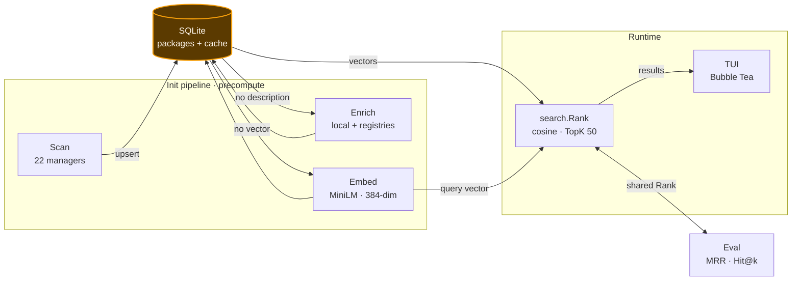
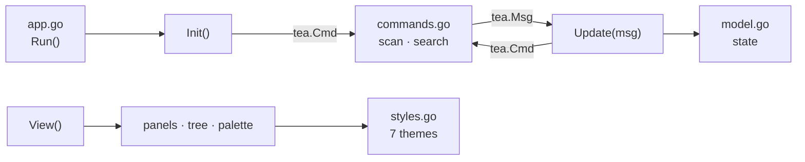

# whatsinstalled — Architecture

How `whatsinstalled` works internally. For usage, detection, and keybindings,
see the [README](README.md).

**Design constraint — a cold search that cannot hang.** All scanning,
enrichment, and embedding run up front in an init pipeline, so a query reduces
to a single in-memory vector ranking.

| Pipeline | Data & Storage | Reference |
|---|---|---|
| [Data Flow](#data-flow) | [Package Layout](#package-layout) | [TUI Structure](#tui-structure) |
| [Init Pipeline](#initialisation-pipeline) | [Database Schema](#database-schema) | [Development](#development) |
| [Search Pipeline](#search-pipeline) | [Dependency / Sizes / Location](#dependency-detection) | [Runtime Facts](#runtime-facts) |
| [Evaluation Harness](#evaluation-harness) | | [Roadmap](#roadmap--future-work) |

---

## Data Flow

SQLite is the hub: every stage reads from and writes back to it. Everything left
of `search.Rank` is pre-computation that runs only at init.



---

## Package Layout

| Package | Responsibility |
|---|---|
| `cmd/whatsinstalled` | Binary entrypoint |
| `cmd/enrich` | One-off enrichment backfill helper |
| `internal/cmd` | Cobra commands — root (TUI), `scan`, `eval` |
| `internal/scanner` | One file per manager (22); `Scanner` interface + discovery registry |
| `internal/store` | SQLite persistence — `Package`, CRUD, migrations, `PurgeStale` |
| `internal/enrich` | Descriptions — local tools, remote registries, 30-day cache |
| `internal/nlp` | MiniLM embedder, query expansion, keyword scoring |
| `internal/search` | Pure ranking (`Rank`, `Options`) + eval harness |
| `internal/tui` | Bubble Tea dashboard, split by concern |
| `internal/pkg` | Environment helpers — home, owner, last-used |
| `internal/version` | `Version` constant (drives release tagging) |

### TUI module structure

Background work is dispatched as a `tea.Cmd` off the UI goroutine and returns as
a `tea.Msg`, so `Update` never blocks.



---

## Database Schema

```sql
CREATE TABLE packages (
    id        INTEGER PRIMARY KEY,
    name      TEXT NOT NULL,
    version   TEXT,
    source    TEXT NOT NULL,
    location  TEXT NOT NULL,
    size_bytes      INTEGER,
    description     TEXT,
    installed_at    TEXT,
    auto_installed  INTEGER DEFAULT 0,
    user      TEXT,
    updated_at INTEGER,
    last_used  INTEGER,
    embedding  TEXT          -- JSON float array (384-dim)
);
CREATE UNIQUE INDEX idx_pkg ON packages(name, source, location);

CREATE TABLE enrichment_cache (
    name TEXT NOT NULL,
    source TEXT NOT NULL,
    description TEXT NOT NULL,
    fetched_at  INTEGER NOT NULL,
    PRIMARY KEY (name, source)
);
```

Path `~/.whatsinstalled.db`, overridable via `WHATSINSTALLED_DB` or `--db`. WAL
mode; writes are single-writer / sequential.

| Store method | Purpose |
|---|---|
| `Upsert` | `INSERT … ON CONFLICT(name,source,location) DO UPDATE` |
| `List` / `Search` / `SearchText` | filtered reads (`LIKE` on name, or name + description) |
| `ListWithEmbeddings` / `ListWithoutEmbeddings` | partition by vector presence |
| `ListWithoutDescriptions` | enrichment work queue |
| `CountBySource` | per-source totals for tabs |
| `UpdateManyDescriptions` / `UpdateEmbedding` | batched precompute writes |
| `PurgeStale` | drop packages not seen this scan cycle |

---

## Initialisation Pipeline

`fullInitWithProgress()` runs on startup and on `r` (rescan), streaming progress
to the splash/status UI. Cached data renders immediately while the pipeline
refreshes in the background.

| Phase | Selects | Does | Writes |
|---|---|---|---|
| **1 · Scan** | available scanners (`IsAvailable` + cheap `Probe`) | one goroutine per scanner (subprocess-bound, so wall-clock ≈ slowest) | `Upsert`, then `PurgeStale` |
| **2 · Enrich** | packages without a description | route per source (local tool → remote registry) | descriptions + 30-day cache |
| **3 · Embed** | packages without a vector | `PackageText` → `all-MiniLM-L6-v2` (384-dim) | JSON vector |

Enrichment routing:

| Source | Path |
|---|---|
| bin | `whatis` + `dpkg -S` → `apt show` |
| apt / snap / brew | `apt show` / `snap info` / `brew info --json=v2` |
| pacman / yay | `pacman -Qi` |
| pip / pipx / uv | `pip show` → PyPI |
| npm / pnpm / yarn | `npm info` → npm registry |
| gem | `gem list --details` → rubygems.org |
| docker, podman, go, appimage, nix, flatpak | none |

---

## Search Pipeline

| Step | Action |
|---|---|
| 1 | `?` opens the **Ask whatsinstalled** modal |
| 2 | live `SearchText()` substring preview while typing |
| 3 | `Enter` → `runSearch` (`tea.Cmd`): `ExpandQuery` → `Encode` → `ListWithEmbeddings` → `Rank` |
| 4 | result tagged with `searchVersion`; superseded searches are discarded |
| 5 | TUI switches to the **Results** tab |

`Score = cosine(query, pkg) + KeywordWeight × keyword`, sorted descending,
filtered at threshold `0.05`, capped at `TopK 50`.

| Variant | KeywordWeight | Threshold | ExpandQuery |
|---|---|---|---|
| default / semantic-only | 0.0 | 0.05 | true |
| no-expand | 0.0 | 0.05 | false |
| keyword-2x | 2.0 | 0.05 | true |
| thr-0 | 0.0 | 0.0 | true |

**Graceful degradation**

| Condition | Fallback |
|---|---|
| No embedder cached | `SearchText()` substring match |
| Fresh DB, no vectors yet | `SearchText()` while embedding runs in background |

---

## Dependency Detection

Sub-dependencies (installed as a side-effect, not by the user) are flagged in
`auto_installed` and rendered with a `↳` prefix. Toggle with `D` (default:
shown); they are hard-excluded from any future removal tooling.

| Source | Method | Coverage |
|---|---|---|
| **apt** | `apt-mark showmanual` cross-reference | all packages |
| **pip** | `pip show` `Required-by:` (one call per venv) | system + local venvs |
| **conda** | `conda-meta/*.json` `requested_spec` | all environments |

## Per-Package Sizes

Populated from the package's filesystem path when one can be resolved at scan
time. Sources without a per-package path (snap, flatpak, pacman, yay, nix, brew,
go, gem, pnpm, yarn, pixi) leave size empty.

| Source | Size from | Coverage |
|---|---|---|
| **apt** | `dpkg` `Installed-Size` | 100% |
| **bin** / **cargo** / **appimage** | file size | 100% |
| **docker** / **podman** | JSON `Size` field | 100% |
| **pipx** / **uv** | recursive `du` of venv | 100% |
| **pip** | site-packages dir | ~54% |
| **npm** | `node_modules/<name>` | ~60% |
| **conda** | `pkgs/<name>-<version>-<build>` | ~32% |

The pip/conda/npm gap is single-file modules and namespace packages that don't
follow the standard per-package directory layout.

## Location Tracking

Scanners report real filesystem paths in `location`, so the tree view groups by
meaningful paths instead of generic `system` / `local` labels.

| Source | Location |
|---|---|
| **apt** | `/var/lib/dpkg` |
| **snap** | `/snap/<name>` |
| **pip** | site-packages path (`pip show Location:`) |
| **npm** | `npm root -g` (global) / project dir (local) |
| **conda** | full environment path |
| **docker** / **podman** | stat-detected data / storage root |

---

## Evaluation Harness

`whatsinstalled eval` runs the **same** `search.Rank()` as the TUI, so metrics
(MRR, Hit@1/3/10) reflect real ranking. Queries come from a curated golden set
(`internal/search/eval/queries.json`) plus optional synthetic known-item queries.

```bash
whatsinstalled eval                          # default variant, curated + 30 synthetic
whatsinstalled eval --synthetic 50           # more synthetic queries
whatsinstalled eval --variant all            # every variant
whatsinstalled eval --out r.json             # save results
whatsinstalled eval --baseline r.json        # diff against a baseline
```

> **Finding:** the keyword boost hurts relevance (default MRR ≈ 0.64 vs
> keyword-2x ≈ 0.27), so `DefaultOptions` sets `KeywordWeight = 0`. The mechanism
> stays wired so the harness can keep measuring variants.

---

## TUI Structure

```text
┌─ whatsinstalled ── apt:90 │ snap:3 │ npm:14 ──────────── v1.0.0-beta ─┐
│  Name         Version Src  Location        User   Size  Added  Used   │
│  ▾ /var/lib/dpkg            [45]                                       │
│      nginx     1.24.0  apt  /var/lib/dpkg   system 4.2M  12d    3d     │
│      ↳ libssl  3.0.2   apt  /var/lib/dpkg   system 2.1M  12d    -      │
│  ▸ /snap/core20            [3]                                         │
│  [All] [Apt] [Snap] [Npm] [Pip] [Conda] [Bin]            /filter      │
│  Description: nginx — web server          │  :  palette  ?  ask        │
└──────────────────────────────────────────────────────────────────────┘
```

Leaf rows carry 8 columns (Name · Version · Source · Location · User · Size ·
Added · Used). Themes live in `styles.go` (7 built-ins); the choice persists
under `~/.config/whatsinstalled/`. Full keybindings: [README](README.md#key-bindings-tui).

---

## Development

```bash
go build ./...                                   # compile all packages
go build -o whatsinstalled ./cmd/whatsinstalled  # build the binary
go test ./...                                    # doctests + unit + integration
go vet ./...                                     # vet
```

## Runtime Facts

| Item | Detail |
|---|---|
| Database | `~/.whatsinstalled.db` — a **file**, not a directory |
| Model | `~/.whatsinstalled/models/...` (~177 MB, 384-dim); first run downloads it; absent → substring fallback |
| Invariant | Enrichment and embedding are **init-only** — never on the search hot path, so a query can't hang |

---

## Roadmap & Future Work

The architecture works end-to-end; quality and reach are bounded in a few
concrete places. The headline limit is **thin per-package text** — search quality
is capped by how much meaningful text each package carries, and several sources
return no description at all. The planned fix generates richer structured
metadata at init and feeds it into the existing embedding path, preserving the
"no generative call at query time" invariant.

| Area | Gap today | Planned direction |
|---|---|---|
| **Per-package text** | Often just `name + source`; descriptions empty for docker, podman, go, appimage, nix, flatpak. Associations from a static `domainSynonyms` map. | Generate structured metadata (categories, use-cases, related tools) at init and embed it, widening recall. |
| **Ranking fusion** | Hand-set weights; small golden set limits tuning. Keyword boost hurts relevance, so default is `KeywordWeight = 0`. | Treat `search.Options` as tunable, sweep variants via `eval`, grow the query set. |
| **Enrichment coverage** | Gem and conda covered locally; six sources return no description. | Source-specific enrichers (image labels, Go docs, AppStream, nix attrs). |
| **Search scaling** | Every query loads *all* vectors and scores in memory; stored as JSON text. Fine for thousands, not millions. | On-disk / quantized vector index behind the unchanged `Rank` contract. |
| **Usage signal** | `Used` from atime + shell history (CLI only); deps cover apt + pip + conda. | Last-used for libraries; extend dependency detection to npm/brew/cargo. |
| **Temporal view** | Point-in-time snapshot, no history. | Optional snapshots and diffs, staying read-only. |
| **Portability** | Tuned for Debian/Ubuntu and WSL. | Broaden scanner coverage; add cross-distro CI. |
| **Model bootstrap** | ~177 MB download; silent degrade to substring if absent. | Smaller/quantized model option; surface degraded mode in the UI. |
