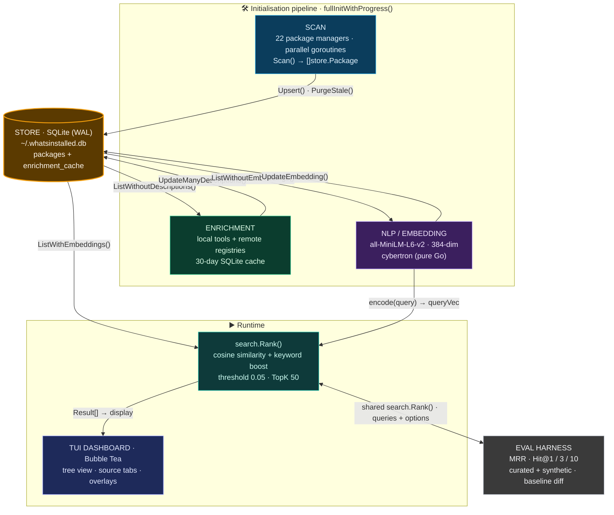
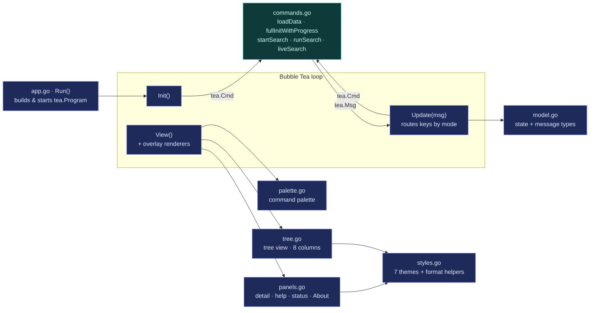

# whatsinstalled — Architecture

`whatsinstalled` is a single-binary Go CLI/TUI that inventories software
installed across **22 package managers**, enriches each package with a
description, embeds it with a BERT model, and answers natural-language
("Ask whatsinstalled") semantic queries over your machine.

The design goal is a **cold search that cannot hang**: scanning, enrichment, and
embedding all happen up front in an init pipeline, so a query is reduced to a
single in-memory vector ranking.

---

## Data Flow

End-to-end pipeline: **Scan → Enrich → Embed → Search → Display**. SQLite is the
hub every stage reads from and writes back to.



> The diagram above is the canonical architecture picture, migrated from the
> former `*-architecture.excalidraw` source into Mermaid so it lives and
> versions alongside the code.

---

## Package Layout

```text
cmd/whatsinstalled   — binary entrypoint (main.go)
cmd/enrich           — one-off enrichment backfill helper

internal/cmd         — Cobra commands
  root.go            — rootCmd, TUI launcher, --db flag
  subcommands.go     — `whatsinstalled scan`
  eval.go            — `whatsinstalled eval` + variant selectors

internal/scanner     — one file per package manager (22 in the registry)
  scanner.go         — Scanner interface: Name, Scan, IsAvailable, Probe
  discovery.go       — AllScanners registry + DiscoverScanners()
  apt · snap · npm · pip · conda · brew · cargo · gem · go · pixi · pipx
  pnpm · yarn · docker · podman · pacman · yay · flatpak · nix · appimage · uv · bin

internal/store       — SQLite persistence
  store.go           — Package struct, Store, Open, migrate, CRUD, DBPath()

internal/enrich      — description enrichment
  enrich.go          — Enricher, EnrichPackages, per-source routing
  local.go           — LocalEnricher: pip show, apt show, brew info, whatis, pacman -Qi
  remote.go          — RemoteEnricher: PyPI, npm, crates.io, rubygems (throttled)
  cache.go           — Cache over enrichment_cache table (30-day TTL)

internal/nlp         — BERT embedding + NLP helpers
  embedder.go        — Embedder, LoadEmbedder, Encode, CosineSimilarity, PackageText
  search.go          — ExpandQuery (domain keyword sets), KeywordScore

internal/search      — pure ranking (no DB / UI / network)
  rank.go            — Options, Result, Rank, DefaultOptions
  eval/eval.go       — Query, Metrics, Report, Regression, Aggregate, Diff
  eval/queries.json  — curated golden queries

internal/tui         — Bubble Tea dashboard (split by concern — see below)
internal/pkg         — environment helpers (HomeDir, IsRoot, FileOwner, GetLastUsed)
internal/version     — const Version = "v1.0.0-beta"
```

### TUI module structure

The dashboard was split out of a single 1.8k-line file into cohesive units that
map onto Bubble Tea's `Init` / `Update` / `View` contract.



All background work (scan, enrich, embed, search) is dispatched as a `tea.Cmd`
that runs off the UI goroutine and feeds results back as a `tea.Msg`; `Update`
never blocks.

---

## Database Schema

```sql
CREATE TABLE IF NOT EXISTS packages (
    id              INTEGER PRIMARY KEY,
    name            TEXT NOT NULL,
    version         TEXT,
    source          TEXT NOT NULL,
    location        TEXT NOT NULL,
    size_bytes      INTEGER,
    description     TEXT,
    installed_at    TEXT,
    auto_installed  INTEGER DEFAULT 0,
    user            TEXT,
    updated_at      INTEGER,
    last_used       INTEGER,
    embedding       TEXT          -- JSON float array (384-dim)
);
CREATE UNIQUE INDEX idx_pkg ON packages(name, source, location);

CREATE TABLE IF NOT EXISTS enrichment_cache (
    name        TEXT NOT NULL,
    source      TEXT NOT NULL,
    description TEXT NOT NULL,
    fetched_at  INTEGER NOT NULL,
    PRIMARY KEY (name, source)
);
```

- DB path: `~/.whatsinstalled.db` (override with `WHATSINSTALLED_DB` env var or `--db`)
- WAL mode via `PRAGMA journal_mode=WAL`; writes are single-writer/sequential.

### Key store methods

| Method | Purpose |
|---|---|
| `Upsert(p Package)` | `INSERT … ON CONFLICT(name,source,location) DO UPDATE` |
| `List(source, hideAuto)` | packages with optional source filter |
| `ListWithEmbeddings()` | packages where `embedding IS NOT NULL` |
| `ListWithoutEmbeddings()` | packages where `embedding IS NULL` |
| `ListWithoutDescriptions(source)` | packages with empty description |
| `Search(query, source, hideAuto)` | `name LIKE %query%` |
| `SearchText(query)` | `name OR description LIKE %query%` |
| `CountBySource(hideAuto)` | `map[string]int` + total |
| `UpdateManyDescriptions(missing)` | batch description write |
| `UpdateEmbedding(id, embedding)` | store JSON vector |
| `PurgeStale(cutoff)` | drop packages not seen in the current scan cycle |

---

## Initialisation Pipeline

`fullInitWithProgress()` runs on startup and on `r` (rescan). It streams progress
over a channel that drives the splash/status UI. If cached data already exists,
the dashboard renders immediately and the pipeline refreshes in the background.

### Phase 1 — Scan

- `scanner.DiscoverScanners()` returns only scanners that are `IsAvailable()` and
  pass a cheap `Probe()`.
- Each scanner runs in its own goroutine (cost is subprocess wait, so parallel
  scans collapse wall-clock to ≈ the slowest one).
- Results are upserted sequentially (single-writer SQLite); `PurgeStale()` then
  removes anything not refreshed this cycle.

### Phase 2 — Enrich

- `ListWithoutDescriptions("")` finds packages with no description.
- Each source is routed to the right enricher:
  - **bin**: `whatis` + `dpkg -S` → `apt show`
  - **apt**: `apt show` · **snap**: `snap info` · **brew**: `brew info --json=v2`
  - **pacman/yay**: `pacman -Qi`
  - **pip/pipx/uv**: `pip show` → PyPI API
  - **npm/pnpm/yarn**: `npm info` → npm registry
  - **cargo**: crates.io · **gem**: rubygems.org
  - others (docker, podman, go, appimage, nix, flatpak): no description
- Results are cached in `enrichment_cache` (30-day TTL) and written via
  `UpdateManyDescriptions()`.

### Phase 3 — Embed

- `ListWithoutEmbeddings()` finds packages needing vectors.
- `PackageText(name, source, desc)` builds the embedding input, adding source
  context (e.g. "python package", "debian system package manager").
- Encoded with `all-MiniLM-L6-v2` into a 384-dim vector, stored as JSON in the
  `embedding` column via `UpdateEmbedding()`.

After these phases the DB is fully populated and search is ready.

---

## Search Pipeline

1. `?` opens the **"Ask whatsinstalled"** modal.
2. While typing, `liveSearch()` runs `db.SearchText(query)` for an instant
   substring preview inside the modal.
3. `Enter` → `startSearch()` dispatches `runSearch()` as a `tea.Cmd`:
   - `nlp.ExpandQuery(query)` appends domain synonyms when the query contains a
     known keyword (network, python, web, database, …).
   - `embedder.Encode(ctx, expandedQuery)` → 384-dim query vector.
   - `db.ListWithEmbeddings()` → all packages with pre-computed vectors.
   - `search.Rank(queryVec, query, pkgs, DefaultOptions)`:
     - `Score = CosineSimilarity(queryVec, pkg.Embedding) + KeywordWeight × KeywordScore(query, pkg)`
     - sort descending, filter by threshold (0.05), cap at TopK (50).
4. Results return to the TUI as a `semanticSearchResult` message (tagged with a
   `searchVersion` so a superseded search is discarded).
5. The TUI switches to the **Results** tab and renders the ranked list.

### Search variants

The ranking formula is configurable through `search.Options`:

| Variant | KeywordWeight | Threshold | ExpandQuery |
|---|---|---|---|
| default | 1.0 | 0.05 | true |
| semantic-only | 0.0 | 0.05 | true |
| no-expand | 1.0 | 0.05 | false |
| keyword-2x | 2.0 | 0.05 | true |
| thr-0 | 1.0 | 0.0 | true |

### Graceful degradation

- No embedder cached → search falls back to `SearchText()` (substring match).
- No embeddings yet (fresh DB) → `runSearch()` falls back to `SearchText()`
  while embedding completes in the background.

---

## Evaluation Harness

`whatsinstalled eval` runs the **same** `search.Rank()` used by the TUI, so the
metrics reflect real ranking behaviour:

- **MRR** (Mean Reciprocal Rank)
- **Hit@1, Hit@3, Hit@10**

Queries come from a curated golden set (`internal/search/eval/queries.json`) and
optional synthetic known-item queries (`--synthetic N`).

```bash
whatsinstalled eval                           # default variant, curated + 30 synthetic
whatsinstalled eval --synthetic 50            # 50 synthetic queries
whatsinstalled eval --variant semantic-only   # specific variant
whatsinstalled eval --variant all             # every variant
whatsinstalled eval --out results.json        # save results
whatsinstalled eval --baseline results.json   # diff against a baseline
```

> Current finding: `semantic-only` (KeywordWeight = 0) reaches MRR ≈ 0.64,
> beating `default` (≈ 0.53) — i.e. the keyword boost presently *hurts*
> relevance. Tune via `search.DefaultOptions()`, then re-measure with `eval`.

---

## TUI Structure

```text
┌─ whatsinstalled ── apt:90 │ snap:3 │ npm:14 ─────────── v1.0.0-beta ─┐
│══════════════════════════════════════════════════════════════════│
│  Name      Version Src  Location   User   Size  Added  Used        │
│  ▾ system                    [45]                                   │
│    nginx   1.24.0  apt  system     system 4.2M  12d    3d          │
│    core20  202604  snap system     system  -    30d    -           │
│  ▸ base                      [23]                                   │
│══════════════════════════════════════════════════════════════════│
│  [All] [Apt] [Snap] [Npm] [Pip] [Conda] [Bin]        /filter       │
│══════════════════════════════════════════════════════════════════│
│  ▾ Description                      │ ▾ Keys                         │
│  nginx — web server                 │ :  Command palette             │
│                                     │ ?  Ask whatsinstalled          │
│══════════════════════════════════════════════════════════════════│
│ nginx (apt)  │  whatsinstalled — tokyo-night                       │
└──────────────────────────────────────────────────────────────────┘
```

The tree leaf row has **8 columns**: Name · Version · Source · Location · User ·
Size · Added · Used.

### Keybindings

| Key | Action |
|---|---|
| `j` / `k` / `↑` / `↓` | navigate tree |
| `→` / `l` / `Space` | expand group |
| `←` / `h` | collapse group |
| `Tab` / `Shift+Tab` | switch source tabs |
| `/` | filter (substring, current tab) |
| `?` | "Ask whatsinstalled" semantic search |
| `Enter` / `d` | detail overlay |
| `r` | rescan all |
| `a` | about modal |
| `t` | theme picker (7 themes) |
| `:` | command palette |
| `D` | toggle auto-installed deps |
| `Esc` | clear / close / cancel |
| `q` / `Ctrl+C` | quit |

### Themes

`t` opens a picker with 7 themes — TokyoNight (default), Palenight, Dracula,
Nord, Gruvbox, Catppuccin, Monokai — persisted across restarts.

---

## Commands

| Command | Purpose |
|---|---|
| `whatsinstalled` | launch the TUI dashboard |
| `whatsinstalled scan` | CLI rescan, print per-source counts |
| `whatsinstalled eval` | search-ranking evaluation (MRR / Hit@k) |
| `whatsinstalled eval --synthetic N` | add N synthetic queries |
| `whatsinstalled eval --variant X` | select a ranking variant |
| `whatsinstalled eval --baseline file.json` | diff against a baseline |
| `whatsinstalled --version` | print version |
| `whatsinstalled --db PATH` | override the DB path |

## Build / Test

```bash
go build ./...                                   # compile all packages
go build -o whatsinstalled ./cmd/whatsinstalled  # build the binary
go test ./...                                    # full suite
go vet ./...                                     # vet
```

## Runtime Facts

- DB: `~/.whatsinstalled.db` (a file, **not** a `~/.whatsinstalled/` directory).
- Embedding model: `~/.whatsinstalled/models/sentence-transformers` (~177 MB,
  384-dim). First run downloads it; `nlp.LoadEmbedder()` errors if absent and
  search degrades to the substring fallback.
- The init pipeline (`fullInitWithProgress`) does scan → enrich → embed, so a
  search is just one query-encode plus in-memory scoring — fast, and unable to
  hang. Enrichment and embedding are **pre-computation only**; they never run on
  the search hot path.
