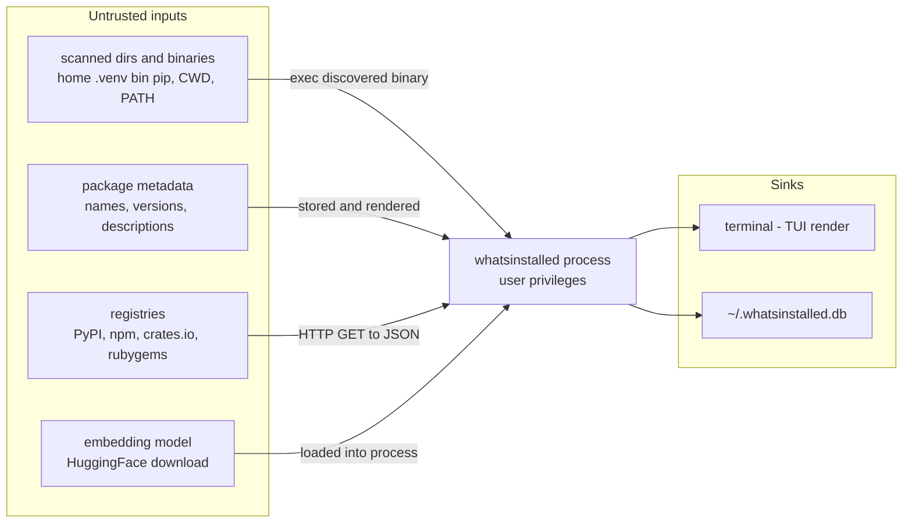

# whatsinstalled — Attack Surface Analysis

A defensive review of where an attacker could influence `whatsinstalled` and what
they could achieve. This is a static analysis of the current code, intended to
guide hardening — not a claim that any issue is remotely exploitable today.

`whatsinstalled` is a **local, single-user CLI/TUI**. It has **no network
listener and no inbound surface** — it is never a server. The interesting
question is therefore not "who can reach it" but "what *untrusted data and
binaries* does it touch while inventorying a machine, and what happens when those
are hostile."

---

## Trust model

**Assets:** the user's account and shell (code-execution context), the local
SQLite DB (`~/.whatsinstalled.db`), and the integrity of what the dashboard
displays.

**Adversaries we care about:**

1. A **malicious file planted in a scanned location** — e.g. a cloned repo or
   extracted archive containing a fake virtualenv, or a binary placed early on
   `PATH`.
2. A **malicious package already installed** by another route, whose name /
   version / description is attacker-chosen.
3. A **compromised or MITM'd registry / model host** feeding hostile responses.

**Out of scope / not a surface (by design):**

- No inbound network — no ports, no RPC, no auth to bypass.
- **SQL is fully parameterized** (`?` placeholders throughout `internal/store/store.go`) — no SQL injection.
- The live scan/enrich path builds subprocesses from **argument slices, not a shell**, so there is no classic shell-string injection on that path.
- Registry calls use the default `http.Client` with **TLS verification on** and a 10 s timeout (`internal/enrich/remote.go`).

---

## Surface summary

| # | Surface | Vector | Worst-case impact | Severity |
|---|---|---|---|---|
| 1 | Executing discovered binaries | fake `.venv/bin/pip` in a scanned dir or CWD | local code execution as the user | **High — fixed** |
| 2 | `PATH` hijacking | malicious `npm`/`docker`/`apt`/… earlier on `PATH` | local code execution as the user | **Medium** |
| 3 | Terminal escape injection | hostile package name/description rendered in the TUI | UI spoofing, terminal-emulator exploits | **Medium** |
| 4 | Registry requests | unescaped package name in URL; unbounded response body | request manipulation, memory DoS | **Low–Medium** |
| 5 | Model supply chain | unpinned model download / writable model cache | loading a tampered model | **Low–Medium** |
| 6 | Local files & DB | `--db`/`WHATSINSTALLED_DB` arbitrary path; file perms; TOCTOU | data tampering / disclosure | **Low** |
| 7 | Dead privileged/shell exec | unwired `sh -c` and `sudo` install/uninstall code | latent injection if re-wired | **Removed** |

---

## 1. Executing binaries discovered in scanned locations — High (pip fixed)

**Status: the pip vector is fixed.** Local virtualenvs are now inventoried by
reading their on-disk metadata instead of executing a `pip` binary found inside
them, and the current-directory scan was removed.

**The original issue.** The pip scanner looked for `.venv` / `venv` / `env`
directories under each entry in `~/*` **and in the current working directory**,
then executed the `pip` binary it found there (`exec.Command(pipBin, "list", …)`
plus `pip show …`). Because that binary comes from a directory that may be
attacker-controlled — a cloned repo, an unpacked tarball, a synced/shared folder
— simply running `whatsinstalled` while sitting in or next to such a tree
executed **attacker-supplied code with the user's privileges**. The CWD case made
it a one-liner: `cd ./malicious-repo && whatsinstalled`.

**The fix** (`internal/scanner/pip.go`):

- `scanVenvMetadata()` reads each venv's `lib/python3*/site-packages/*.dist-info/METADATA`
  (and `*.egg-info/PKG-INFO`) directly — name, version, summary — and **never
  executes anything from the venv**.
- The **current-directory** virtualenv scan was removed entirely.
- A regression test (`pip_test.go`) plants a hostile `bin/pip` in a fake venv and
  asserts it is never run.

The **system** pip is still invoked from `PATH` (`scanWithPip("pip", "system")`),
which is the expected trusted-tool case and is covered by §2 rather than here.

**Still open (lower risk):** the conda scanner prefers `conda` on `PATH`, else
`~/miniconda3/bin/conda` (`internal/scanner/conda.go:57-64`). The home path is
user-owned; the `PATH` lookup is the §2 concern. The same "read metadata, don't
exec discovered binaries" treatment could be applied if warranted.

## 2. `PATH` hijacking — Medium

Every scanner and enricher invokes its tool by **bare name** — `docker`, `npm`,
`pnpm`, `pip`, `apt`/`dpkg`, `snap`, `brew`, `gem`, `cargo`, `flatpak`,
`whatis`, … (e.g. `internal/scanner/docker.go:26`, `internal/scanner/npm.go:32`,
`internal/enrich/local.go:21`). Resolution follows the inherited `PATH`, so any
directory earlier on `PATH` that an attacker can write to lets them shadow one of
these tools and run code the next time whatsinstalled scans or enriches.

Impact rises sharply if whatsinstalled is ever run as **root** (the unwired
`snap` install/uninstall helpers even call `sudo` — see §7).

**Mitigations**
- Resolve tools to absolute paths from a sanitized `PATH` (drop `.` and
  non-system, user-writable entries), or pin known locations.
- Document that whatsinstalled should run as an unprivileged user.

## 3. Terminal escape injection — Medium

Package names, versions, and descriptions are **untrusted** — they come from
registries, local tool output, and image labels — yet they are written straight
to the terminal by the TUI (`internal/tui/tree.go` leaf rows,
`internal/tui/panels.go` detail/description) with no control-character
sanitization. `truncate()` in `internal/tui/styles.go` slices by **byte**, which
can also split multibyte runes or escape sequences.

A package whose description embeds ANSI/OSC escape sequences could therefore
spoof dashboard content, rewrite other lines, set the window title, or — against
a vulnerable terminal emulator — reach known escape-sequence parsing bugs.

**Mitigations**
- Strip or escape C0/C1 control characters (and at least `ESC`) from all
  package-derived text before rendering.
- Make truncation rune-aware.

## 4. Registry requests — Low–Medium

`internal/enrich/remote.go` enriches descriptions over HTTPS. Two weaknesses:

- **Unescaped names in the URL** — `fmt.Sprintf("%s/%s", base, name)` and
  `https://pypi.org/pypi/%s/json` (lines ~145, 157, 168, 198) interpolate the
  raw package name. A crafted name (`../`, `?`, `#`, `%2e%2e`, whitespace) can
  alter the request path/query; combined with the default client's
  **redirect-following**, this is a mild SSRF/abuse primitive. Blast radius is
  limited because the hosts are fixed and the method is GET.
- **No response-size limit** — `fetchJSON` and the PyPI/npm handlers read the
  whole body; a hostile or MITM'd endpoint can return a huge payload (memory
  DoS).

TLS verification (on) and the 10 s timeout are good and should stay.

**Mitigations**
- `url.PathEscape` every name before interpolation.
- Wrap response bodies in `io.LimitReader`.
- Consider disabling redirects for registry calls and offering an offline mode.

## 5. Embedding-model supply chain — Low–Medium

`internal/nlp/embedder.go` (`LoadEmbedder`) downloads ~177 MB on first run via
`cybertron` into `~/.whatsinstalled/models` (created `0o755`). There is no
visible checksum/signature pinning, so model integrity rests on the transport and
the upstream host. The on-disk cache is also a poisoning target: anyone able to
write to the models directory can substitute a tampered model that is then loaded
into the process.

The format (safetensors/flatbuffers via cybertron) avoids Python-pickle
deserialization RCE, which keeps this below "High", but a tampered model can
still corrupt results or exploit loader bugs.

**Mitigations**
- Pin the model revision and verify a checksum after download.
- Ensure the model directory is user-owned and not group/other-writable.
- Allow a fully offline / pre-provisioned model path.

## 6. Local files, DB, and path handling — Low

- **DB location override** — `--db` and `WHATSINSTALLED_DB`
  (`internal/store/store.go:DBPath`) open an arbitrary path. Pointing it at a
  hostile SQLite file relies on SQLite's own robustness; pointing it at a
  sensitive path could clobber it.
- **File permissions** — the DB and model files are created with the process
  umask, not an explicit restrictive mode; on a shared host the inventory may be
  world-readable.
- **TOCTOU** — pip/conda scanning does `os.Stat(pipBin)` then `exec` later; the
  binary could be swapped between check and use.
- Directory walks (`pixi`, `go`, `bin`, `appimage`) follow into user/project
  trees; symlinks are not specifically constrained.

**Mitigations**
- Create the DB `0600`; validate/normalize the `--db` path.
- Open-then-`fstat` instead of stat-then-exec.

## 7. Dead privileged / shell-exec code — Removed

The per-source `Install` / `Uninstall` / `InstallCmd` / `UninstallCmd` methods
were dead (the TUI is read-only — they had no live caller) yet still carried
risky patterns: a `sh -c` with string interpolation in `bin.go`, `sudo snap
install/remove` in `snap.go`, and `rm <location>/<name>`.

**Resolved.** All four methods were deleted from every scanner and from the
`Scanner` interface (`internal/scanner/scanner.go` now declares only `Name`,
`Scan`, `IsAvailable`, `Probe`), along with the helpers that became orphaned
(`resolveEnvPath`, `dirSize`) — ~470 lines removed. The package no longer
contains any `sh -c` or `sudo` invocation, so there is no install/uninstall
execution surface to inherit if such a feature is ever re-introduced.

---

## Hardening priorities

1. **Stop executing binaries from untrusted/CWD paths** (§1) — biggest lever.
   Done for pip (reads `*.dist-info` metadata; CWD scan removed); apply the same
   treatment to conda if warranted.
2. **Sanitize terminal output** of all package-derived strings (§3).
3. **Resolve tools to trusted absolute paths / sanitize `PATH`** (§2) and document
   running unprivileged.
4. **Escape registry URLs and bound response bodies** (§4).
5. **Pin and verify the model** and lock down its cache directory (§5).
6. **Tighten DB permissions** (§6). *(The dead install/uninstall exec code in §7
   has been removed.)*

## What is already solid

- No inbound network surface; not a server.
- Parameterized SQL everywhere (no SQLi).
- No shell on the live scan/enrich path (argument slices only).
- TLS-verified, time-bounded registry calls.
- Goroutine panics during init are recovered, so malformed tool output degrades
  gracefully rather than crashing the app.
